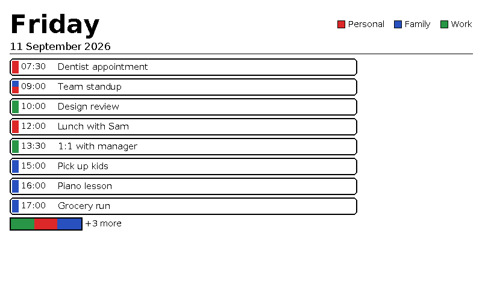

# e-ink-calendar

E-ink household Google Calendar display for Pimoroni Inky Impression 7.3 (Spectra).

A Raspberry Pi drives a 6-colour e-paper panel that shows Day, Week, and Month
views of one or more Google Calendars. Two physical buttons cycle the view and
force a refresh; otherwise the panel redraws once a day on a schedule. It is
built for non-technical family members — once mounted on the wall it runs
unattended indefinitely, with no re-authentication required from them.

---

## Hardware required

| Part | Notes |
|---|---|
| Raspberry Pi 4 (or newer) | Running Raspberry Pi OS Bookworm (system Python 3.11) |
| Pimoroni Inky Impression 7.3" | Spectra 6-colour e-paper, 800×480 |
| microSD card + USB-C power supply | Standard Pi accessories |
| 2 momentary push buttons (optional) | Wired to GPIO for view-cycle and force-refresh; the display works without them |

A Mac (or any non-GPIO machine) is all you need for development — see below.

## What it does

- Fetches events from one or more Google Calendars across one or more Google
  accounts (multi-account is a config change, not a code change).
- Renders a Day, Week, or Month layout with Pillow, mapped to the panel's
  six-colour Spectra palette.
- Refreshes once daily at a configured time; button A cycles Day → Week → Month
  from cache with no network call, button B forces a fetch-and-redraw.
- Keeps the last good render on screen if a refresh fails — the wall never goes
  blank.



## Quick start

1. **Set up a local environment.** From the repo root:

   ```bash
   python3 -m venv .venv
   .venv/bin/pip install -r requirements-dev.txt
   ```

   `requirements-dev.txt` pulls in `requirements-base.txt`, so this one install
   covers both. Activate the venv (`source .venv/bin/activate`) or prefix
   commands with `.venv/bin/` — the examples below assume it's active.
2. **Develop on a Mac.** The codebase imports and runs with no GPIO hardware;
   `inky` and `gpiozero` are loaded lazily only when the config selects the real
   driver. `scripts/render_once.py` is the fast iteration loop — it renders the
   configured view through the mock display driver to a PNG.
3. **Configure.** Copy `config/config.example.yaml` to
   `~/.config/eink-calendar/config.yaml` (outside the repo checkout) and fill in
   real values. OAuth credentials and tokens live in `~/.config/eink-calendar/`
   too — never in the repo.
4. **Authorise each Google account once** with `scripts/setup_oauth.py --account <name>`,
   run by a human with a browser.
5. **Deploy to the Pi** and run as a systemd service (`python -m eink_calendar.app`).

Full setup, wiring, and operational procedures are in the docs below.

## Development

`scripts/render_once.py` is the recommended fast iteration loop for layout,
colour, and font work — it renders one frame through the mock display driver on
a Mac with no Pi and no GPIO. It writes `data/last_render.png` at
`config.display.resolution`. These examples assume the venv from Quick start
step 1 is active (or prefix each command with `.venv/bin/`).

```bash
# one-shot render of the current cache, opens the PNG — no network, no Pi
python scripts/render_once.py --use-cache --open

# refresh from Google first, then render
python scripts/render_once.py --open
```

| Flag | Effect |
|---|---|
| `--use-cache` | Render from `cache.json` only; skip the network call entirely |
| `--view {day,week,month}` | Override `config.view.default` for this render |
| `--open` | Open the resulting PNG |
| `--config <path>` | Use a specific config file instead of the default search path |

## Documentation

- [docs/architecture.md](docs/architecture.md) — module layout, config schema,
  main loop and scheduling, OAuth flow, colour palette, deploy, and security
  considerations.
- [docs/design-workflow.md](docs/design-workflow.md) — iterating on the Day /
  Week / Month layouts: the mock render loop, real-Pi preview, and handoff to
  the product-designer persona.
- [docs/runbook.md](docs/runbook.md) — end-user install guide and
  credential revoke/rotate procedure.
- [docs/acceptance-criteria.md](docs/acceptance-criteria.md) — MVP acceptance
  criteria.
- [CLAUDE.md](CLAUDE.md) — how the AI agent personas operate in this repo.

## Why the persona / worktree workflow

This repo is built with [claude-scaffolding](https://github.com/mak3r/claude-scaffolding),
a multi-agent Claude Code setup. Work is divided among nine personas
(developer, test-engineer, security, qa, gitops-manager, docs,
product-designer, merge-manager, triage), each operating from its own git
worktree with a fixed file-ownership scope. Every change flows through a
GitHub issue and a PR gated by CI. If you are browsing the repo and the
`persona/*` branches or the issue labels look unfamiliar, that is why —
`CLAUDE.md` documents the full workflow.

## License

Copyright 2024-present Mark Abrams. Licensed under the [Apache 2.0 License](LICENSE).
